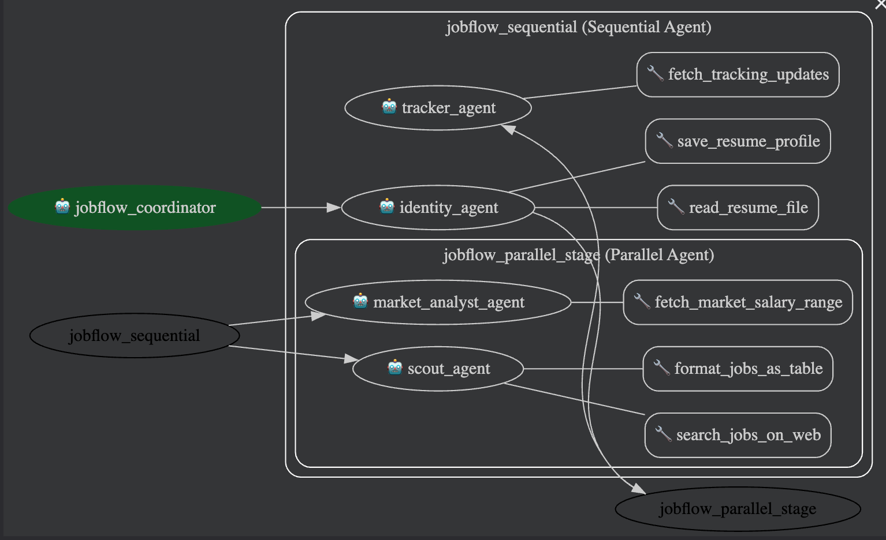

# JobFlow-ADK — Assistant de recherche de travail (Système multi-agents)

Système multi-agents développé avec le framework **Google ADK**. Pipeline de recherche d’emploi : analyse de CV, découverte de postes, estimation de salaire marché et suivi des candidatures (Identity → Scout & MarketAnalyst en parallèle → Tracker).

---

## Architecture multi-agents

```
coordinator (LlmAgent, root_agent)
└── workflow (SequentialAgent)
    ├── identity_agent      (LlmAgent) — lecture CV, confirmation utilisateur, output_key: confirmed_resume_profile
    ├── parallel_stage       (ParallelAgent)
    │   ├── scout_agent      (LlmAgent) — recherche de postes, output_key: job_search_results
    │   └── market_analyst_agent (LlmAgent) — fourchette salariale, output_key: market_salary_report
    └── tracker_agent       (LlmAgent) — suivi des candidatures, output_key: final_application_report
```

### Interface ADK Web


## Techniques utilisées

| # | Techniques | Impléentation |
|---|---|---|
| 1 | Minimum 3 agents | 4 LlmAgents : identity_agent, scout_agent, market_analyst_agent, tracker_agent (+ coordinator) |
| 2 | Au moins 3 tools custom | 6 tools : `read_resume_file`, `save_resume_profile`, `search_jobs_on_web`, `format_jobs_as_table`, `fetch_tracking_updates`, `fetch_market_salary_range` (docstrings, type hints, gestion d’erreurs) |
| 3 | Au moins 2 Workflow Agents | `SequentialAgent` (workflow) + `ParallelAgent` (parallel_stage) |
| 4 | State partagé | `output_key` sur chaque agent ; instructions avec `{confirmed_resume_profile}`, `{job_search_results}` |
| 5 | Délégation | `transfer_to_agent` : coordinator → workflow (AgentTool non utilisé) |
| 6 | Au moins 2 callbacks | `before_tool_callback` (identity_agent, read_resume_file) ; `after_tool_callback` (tracker_agent, fetch_tracking_updates) |
| 7 | Runner programmatique | `main.py` avec `Runner` + `InMemorySessionService` |
| 8 | Démo fonctionnelle | `adk web` depuis la racine du projet |

---

## Installation

```bash
# 1. Cloner le projet
git clone <url-du-repo>
cd projet_agent

# 2. Créer l’environnement virtuel
python -m venv .venv

# 3. Activer l’environnement
# Mac/Linux :
source .venv/bin/activate
# Windows PowerShell :
# .venv\Scripts\Activate.ps1

# 4. Installer les dépendances
pip install -r requirements.txt

# 5. Configurer les clés API (si modèle cloud, ex. Gemini via LiteLLM)
# Copier .env.example en .env et renseigner les variables (ex. GEMINI_API_KEY).
# Ne pas commiter .env.
```

---

## Lancement

### Interface web (recommandé)

```bash
# À la racine du projet
adk web
```

Ouvrir http://localhost:8000 et sélectionner l’application (ex. `my_agent`).

### Terminal (une requête exemple)

```bash
python main.py
```

### CLI ADK

```bash
adk run my_agent
```

---

## Exemples de requêtes

- *« Please review my resume. »* — le coordinator transfère au workflow.
- Fournir un chemin de fichier CV (ex. `my_agent/tests/sample_resume.json`) pour lancer Identity → confirmation → Scout & MarketAnalyst → Tracker.
- Répondre *« No modifications »* ou *« Confirm »* après le résumé du CV pour enregistrer le profil et enchaîner sur la recherche de postes.
